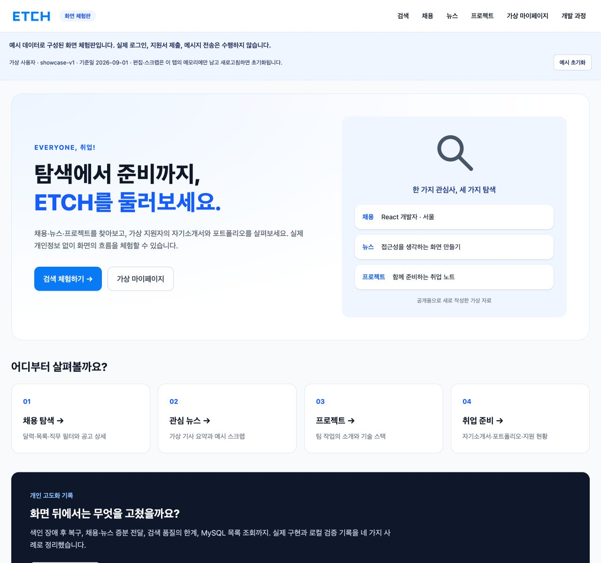
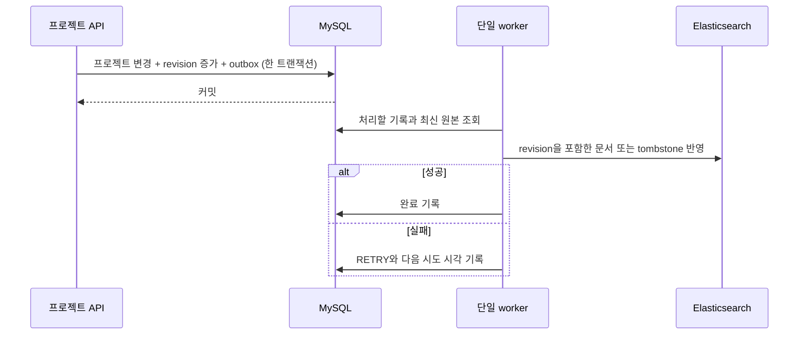

# ETCH — 채용·뉴스·프로젝트 통합 탐색

취업 정보를 한곳에서 찾고, 자기소개서와 포트폴리오를 정리하는 서비스입니다.

**[화면 체험판](https://etch-showcase.pages.dev/) · [기술 사례](https://etch-showcase.pages.dev/process)**  
가상 데이터로 화면을 둘러볼 수 있습니다. 편집 내용은 탭 메모리에만 남고 새로고침하면 초기화됩니다.



2026-10-08 공개 사이트를 Chrome에서 직접 캡처했습니다. 아래 백엔드 사례는 실제 로컬 구현·검증이며, 공개 체험판은 해당 서버를 호출하지 않습니다.

## 맡은 일

2025년 7~8월, 6인 팀에서 백엔드 리드와 검색 담당으로 핵심 API, 통합 검색, Elasticsearch 색인·필터와 채용 전처리에 참여했습니다. 기존 화면·추천·채팅·팀 인프라와 뉴스 URL SHA-256·채용 외부 ID 중복 방지는 팀 구현입니다.

이후 개인 작업에서는 검색 반영 실패의 재처리, 목록의 추가 SQL, 증분 전달, 검색 결과 비교를 다뤘습니다. 이 사본은 그 개선 소스와 검증 도구를 함께 읽고 실행할 수 있게 정리한 로컬 제출 후보입니다.

| 문제 | 선택한 방법 | 확인한 결과 |
|---|---|---|
| DB 저장 뒤 검색 반영 실패 | 트랜잭션 outbox, 지속 재시도, revision·tombstone | 검증한 중단·재시작에서 최신 상태 복구 |
| 작성자마다 늘어나는 목록 SQL | 목록 메서드에만 EntityGraph | 다른 작성자 100건, JDBC 102→2회 |
| 엔진 변경 후 순위 차이 | 고정 질의·관련도 라벨·분리된 비교 | 두 질의의 순위 손실을 기록하고 기준선 채택 |
| 변경이 없어도 전체 데이터 조회 | 변경 추적, JDBC 겹침 조회, PQ·DLQ | 1건 변경의 반환 1행과 전달 장애 복구 확인 |

## 검색 색인 자동 복구

DB 커밋 후 이벤트로 색인을 반영하던 방식은 Elasticsearch가 중단되면 재처리할 기록이 남지 않았습니다. 프로젝트 변경과 outbox를 같은 트랜잭션에 저장하고, worker가 최신 원본을 다시 읽어 반영하도록 바꿨습니다.



ES 중단 중 수정, 백엔드 강제 종료·재시작, ES 복구 후 최신 revision·내용·삭제 상태를 대조했습니다. 단일 worker의 복구 검증이며 다중 worker 조정과 ES 전체 데이터 소실 복구는 남아 있습니다.

코드: [트랜잭션 기록](etch/backend/business-server/src/main/java/com/ssafy/etch/search/indexing/ProjectIndexOutbox.java), [worker](etch/backend/business-server/src/main/java/com/ssafy/etch/search/indexing/ProjectIndexWorker.java), [최신 원본 조회](etch/backend/business-server/src/main/java/com/ssafy/etch/search/indexing/ProjectIndexStore.java), [revision·tombstone 반영](etch/backend/business-server/src/main/java/com/ssafy/etch/search/indexing/ProjectIndexWriter.java).  
검사: [접근 권한](etch/backend/business-server/src/test/java/com/ssafy/etch/security/AuthorizationIntegrationTest.java), [worker](etch/backend/business-server/src/test/java/com/ssafy/etch/search/indexing/ProjectIndexWorkerTest.java), [writer](etch/backend/business-server/src/test/java/com/ssafy/etch/search/indexing/ProjectIndexWriterTest.java), [장애 재현 절차](local/verify-project-recovery.py).

## MySQL 목록 조회

목록에서 작성자 닉네임을 읽을 때 지연 로딩이 발생했습니다. 같은 작성자는 한 영속성 컨텍스트에서 재사용되므로, 같은 작성자와 서로 다른 작성자를 나눠 재현했습니다. 목록 메서드에만 EntityGraph를 적용해 필요한 작성자 정보를 함께 읽었습니다. 전역 EAGER나 새 캐시는 도입하지 않았습니다.

| 첫 전체 페이지의 반환 건수 | 같은 작성자: 전→후 | 다른 작성자: 전→후 |
|---:|---:|---:|
| 1 | 3→2 | 3→2 |
| 3 | 3→2 | 5→2 |
| 10 | 3→2 | 12→2 |
| 30 | 3→2 | 32→2 |
| 100 | 3→2 | 102→2 |

실제 MySQL 합성 데이터에서 세 정렬 모두 같은 실행 횟수를 확인했습니다. Controller 직접 호출→DTO/JSON 직렬화 구간의 JDBC 실행 횟수이며 응답시간 측정은 아닙니다. Formula 내부 집계 비용은 남습니다.

동일 **158조건의 전체 응답 JSON**과 공개·삭제 필터, 자료형·NULL·정렬·페이지 계약이 같았습니다. 조회 전후 21개 테이블의 업무 데이터·revision·outbox도 불변이었습니다. 관련 **50테스트 중 실제 MySQL MockMvc는 5개**이며 나머지는 H2·mock 회귀입니다. 158조건은 HTTP 요청 수나 테스트 메서드 수가 아닙니다.

마지막·빈 페이지는 별도입니다. 크기 100, 다른 작성자 5건이 남은 마지막 페이지는 6→1회, 다음 빈 페이지는 2→2회였습니다. 이전의 중복 좋아요 COUNT 제거는 **JPA/H2 동일 3건 페이지의 SQL 7→4회**로, 이번 측정과 조건이 다릅니다.

코드: [목록 Repository](etch/backend/business-server/src/main/java/com/ssafy/etch/project/repository/ProjectRepository.java), [목록 Service](etch/backend/business-server/src/main/java/com/ssafy/etch/project/service/ProjectServiceImpl.java).  
검사: [작성자·페이지별 계측](etch/backend/business-server/src/test/java/com/ssafy/etch/project/service/ProjectListMysqlIntegrationTest.java), [MySQL 권한 검사](etch/backend/business-server/src/test/java/com/ssafy/etch/project/service/ProjectListMysqlAuthorizationIntegrationTest.java), [비교 JSON](docs/portfolio/evidence/project-list-mysql/comparison.json), [재현 도구](local/project-list-mysql.py).

## 검색 결과를 비교하고 결정한 과정

ES/Nori 9.4.7·Java Client 9.4.5에서 고정 30질의와 통합검색 4개를 비교했습니다. React 관련 채용·뉴스 두 질의에서 직접 관련 결과가 2위에서 3위로 내려갔고, 각 nDCG@5는 **0.926045→0.881078**이었습니다. 결과 소실이 없는 것을 확인하고 이 손실을 기준선의 한계로 수용했습니다.

현재 기준선 일치와 과거 엔진 대비 **2건 FAIL**을 별도로 보존했습니다. 평가는 AI 도구로 작성한 유형별 24개 합성 자료·720개 관련도 판정을 사용합니다. 실사용자 조사나 전문가 판정 기반 정확도는 아닙니다.

코드: [평가기](deploy/rc/evaluate.py), [라벨 작성 방식](local/evaluation/build-corpus.py), [고정 질의·라벨](local/evaluation/queries.json), [코퍼스](local/evaluation/corpus.json).  
근거: [현재 기준선 결과](docs/portfolio/evidence/phase8/es947-current-regression/summary.json), [과거 엔진 비교](docs/portfolio/evidence/phase8/es947-final/summary.json), [원래 승인 기록](docs/portfolio/evidence/phase8/search-baseline-approval.json). 사본의 새 빌드가 과거 이미지·JAR의 승인에 자동 포함되지는 않습니다.

## 증분 동기화

주기적인 전체 조회를 변경 추적과 최근 구간을 겹쳐 읽는 JDBC 조회로 바꿨습니다. 전달 실패는 영속 큐(PQ)에서 재시도하고, 개별 문서 오류는 DLQ 확인 후 현재 DB 원본으로 복구합니다. 시험 조건의 1건 변경에서 반환 1행을 확인했으며, 이는 DB 스캔량이나 성능 배수가 아닙니다.

checkpoint 이동이나 PQ가 빈 것만으로 성공을 판정하지 않고 revision·내용·삭제 상태를 대조합니다. 겹침 구간 밖의 지연 커밋과 누락은 별도 대조가 필요합니다.

코드: [변경 추적 스키마](local/mysql/003-job-news-sync.sql), [채용 입력](local/logstash/pipeline/job.conf), [뉴스 입력](local/logstash/pipeline/news.conf), [현재 원본 재처리 도구](local/search-sync.py).  
검사: [증분·삭제·경계](local/verify-incremental-sync.py), [PQ·DLQ 복구](local/verify-logstash.py), [복구 도구 테스트](local/test-search-sync.py).

## 실행과 확인

[실행 안내](docs/RUN.md)와 [이번 사본의 검증 결과](docs/VALIDATION.md)를 먼저 확인하세요. 과거 실험과 이번 새 실행은 구분해 기록했습니다.

```sh
cd etch/frontend
npm ci --ignore-scripts --no-audit --no-fund
npm test
npm run test:showcase
npm run build
npm run build:showcase
npm run preview:showcase
```

정적 화면은 `http://127.0.0.1:5207`입니다. [공통 진입점](etch/frontend/src/main.tsx)·[showcase 라우터](etch/frontend/src/showcase/router.tsx), [가상 데이터 공급부](etch/frontend/src/showcase/data.ts), [별도 빌드 설정](etch/frontend/vite.showcase.config.ts), [브라우저 검사](etch/frontend/tests/browser/showcase.spec.ts)가 포함됩니다. 일반 API 모드의 인증·서버 연결 코드는 별도로 유지했습니다.

## 한계와 이용 범위

실제 백엔드는 외부 미배포 상태입니다. 공개 체험판의 검색은 문자열 검색이며 ES 평가 시연이 아닙니다. 이 사본에서 수정한 `/process` 문구는 아직 공개 사이트에 배포하지 않았습니다.

[SECURITY.md](SECURITY.md)에 서버 패키지 잔여와 외부 자격증명 조치 상태를 남겼습니다. 소스 정리·로컬 검증을 운영 보안 완료로 확대하지 않습니다. 이력 처리와 최종 공개 대상은 별도 결정입니다.

기존 팀의 MIT 선언과 저작권 고지를 [LICENSE](LICENSE)에 보존했습니다. 출처가 확인되지 않은 팀 raster 자산 16개는 사본에서 제외하고 자체 SVG 4개로 연결했습니다. [자산·출처와 기여 구분](docs/PROVENANCE.md)을 참고하세요.
